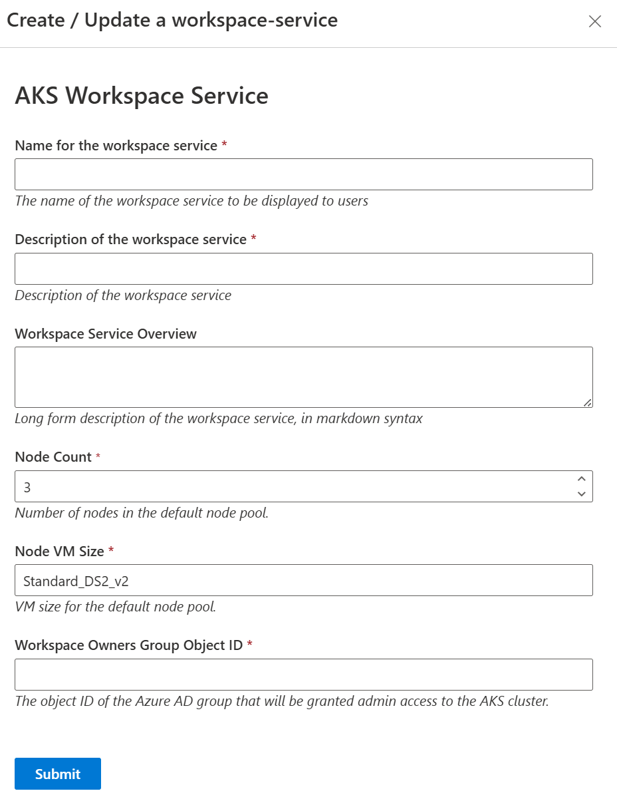

# AKS Workspace Service

See: [Azure Kubernetes Service (AKS)](https://learn.microsoft.com/en-us/azure/aks/)

## Firewall Rules

The AKS workspace service opens outbound access to:

- AzureActiveDirectory
- Microsoft Entra ID CDN - `https://aadcdn.msftauth.net`
- Required AKS FQDNs for control plane, registry, updates, monitoring, and policy endpoints (see [AKS outbound rules](https://learn.microsoft.com/en-us/azure/aks/outbound-rules-control-egress))
- OS update sources (e.g., `security.ubuntu.com`, `azure.archive.ubuntu.com`)

Additionally, the workspace network security group (NSG) allows inbound traffic from the Azure Load Balancer, which is required for AKS node health probes.

## Prerequisites

- [A base workspace deployed](../workspaces/base.md)

- The example AKS images (for Gitea and Hello World) need to be built and pushed to your management ACR:

  `make build-and-push-example-aks-images`

- The AKS workspace service container image needs building and pushing:

  `make workspace_service_bundle BUNDLE=aks`

## Deployment Steps

1. Ensure you have completed all prerequisites above.
2. Deploy the AKS workspace service using the TRE UI or CLI.
3. After deployment, the workspace UI will display private server URLs for the AKS services (e.g., Gitea, Hello World).
4. Access these services from any VM inside the workspace using the provided private URLs.

## Accessing AKS Services

To access the AKS services (such as Gitea or Hello World) from a VM inside the workspace, use the private server URLs shown in the workspace UI. These URLs provide secure, internal-only access to the deployed services. Direct access to the AKS cluster itself is not required for typical usage.
